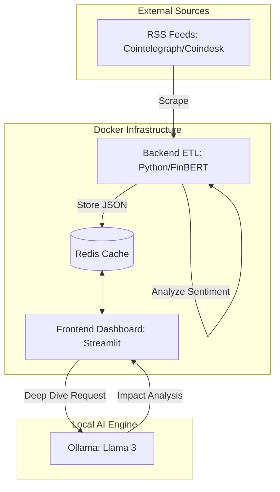
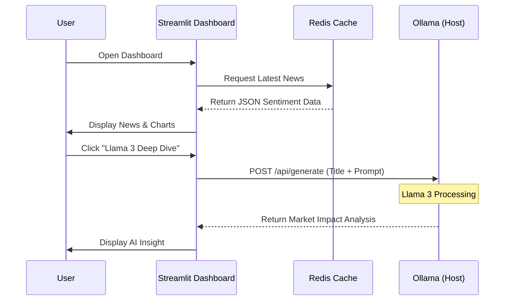
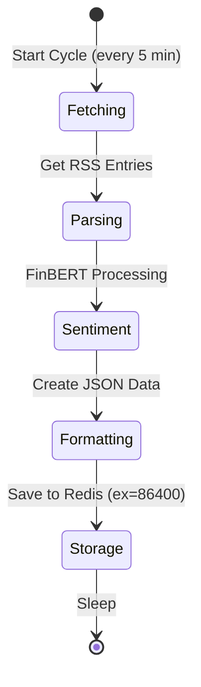
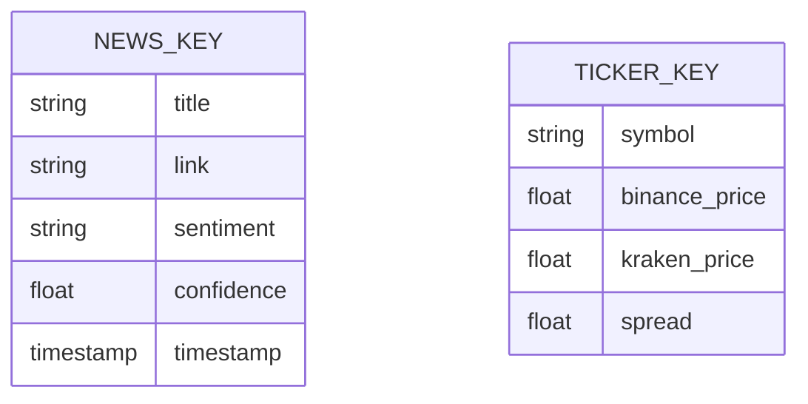

# Sentiment Alpha

Sentiment Alpha is an advanced AI pipeline designed for real-time tracking of cryptocurrency market narratives. The system scrapes financial news, performs high-speed sentiment analysis using specialized NLP models, and provides deep-dive insights through a local Large Language Model.


## Key Features

- Real-Time ETL Pipeline: Automatically fetches and processes news from major crypto sources every 5 minutes.
- Dual-Layer AI Analysis:
  - Fast Layer: Uses FinBERT to classify sentiment and confidence scores in milliseconds.
  - Deep Layer: Integrates with Ollama (Llama 3) for on-demand market impact explanations and bulk narrative summaries.
- Dynamic Intelligence Feed: A reactive Streamlit dashboard featuring:
  - Sentiment Index: A weighted average score indicating overall market mood.
  - Topic Clusters: An automated word cloud of trending market keywords.
  - Sentiment Flow: A sequential area chart showing the rolling narrative trend.
  - Confidence Filtering: User-controlled threshold to filter out low-confidence market noise.

## System Architecture

The project follows a modular microservices architecture orchestrated with Docker.



## Data and Analysis Flow

This sequence diagram illustrates how the system handles user interactions and background updates.



## Backend Pipeline Logic

The following state diagram describes the continuous ETL (Extract, Transform, Load) cycle of the backend engine.



## Data Schema

The following diagram defines the JSON structure for the news data stored in Redis. This schema ensures consistency between the Backend ETL and the Frontend Dashboard.



## Tech Stack

- Language: Python 3.10
- Sentiment AI: ProsusAI/FinBERT (Transformers/PyTorch)
- LLM Engine: Ollama (Llama 3)
- Database: Redis (Alpine)
- Visualization: Streamlit, Altair, WordCloud, Matplotlib
- Orchestration: Docker, Docker Compose

## Installation and Setup

1. Prerequisites

- Docker and Docker Compose
- Ollama installed on host machine

2. Prepare AI Models

Download the Llama 3 model for deep-dive analysis:

```bash
ollama pull llama3
```

3. Launch Application

Clone the repository and run the containerized stack:

```bash
docker-compose up --build
```

4. Access Dashboard

Open your browser and navigate to:

```bash
http://localhost:8501
```

## Analytics Deep Dive

**Sentiment Flow (Sequential Trend)**
This chart utilizes a 3-period rolling average to smooth out market volatility, providing a clearer view of the narrative trajectory. It helps traders identify if the market sentiment is improving or deteriorating sequentially.

**Topic Clusters (Word Cloud)**
A real-time visualization of word frequency within analyzed headlines. Large terms represent dominant market topics, allowing for instant identification of the current main narrative.

## Future Roadmap

- Arbitrage Bridge: Integration with the Crypto Arbitrage Stealth Engine to correlate sentiment with market spread fluctuations.
