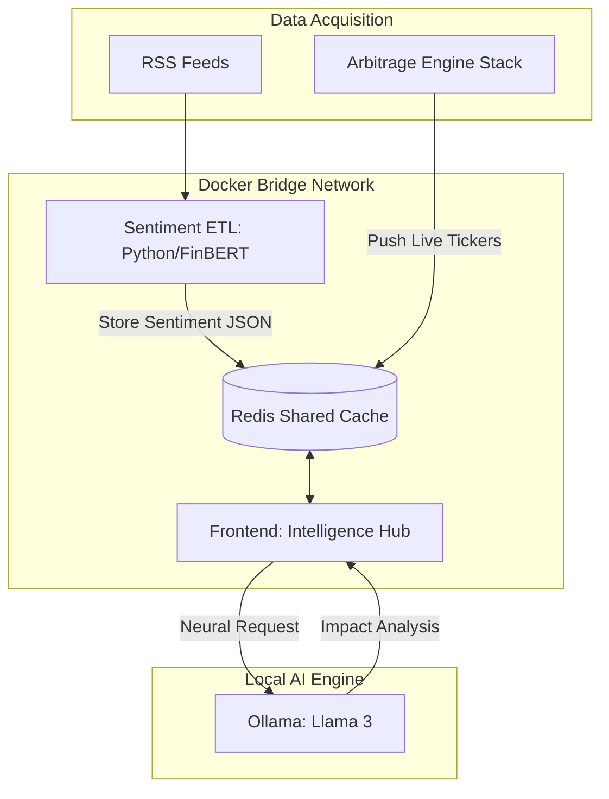
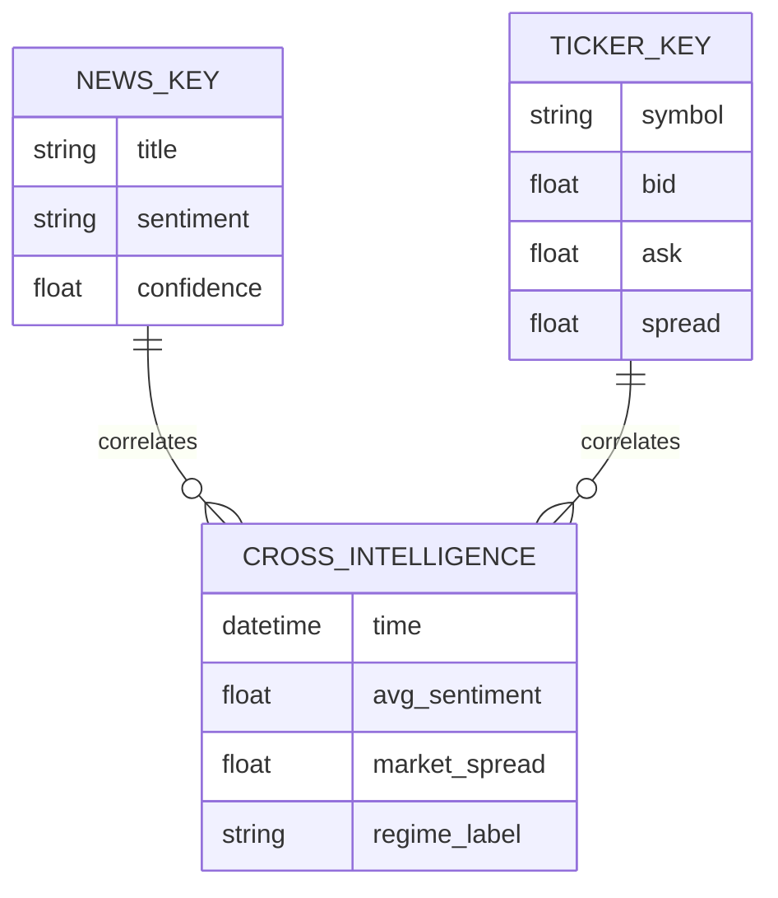

# Sentiment Alpha

Sentiment Alpha is an AI pipeline designed for real-time tracking of cryptocurrency market narratives and their direct impact on market efficiency. The system correlates high-speed sentiment analysis with live exchange spreads to identify narrative-driven arbitrage opportunities.


## Key Features

- Real-Time ETL Pipeline: Automatically fetches and processes news from major crypto sources every 5 minutes.
- Dual-Layer AI Analysis:
  - Fast Layer: Uses FinBERT to classify sentiment and confidence scores in milliseconds.
  - Deep Layer: Integrates with Ollama (Llama 3) for on-demand market impact explanations and global narrative synthesis.
- Cross-Intelligence Trajectory: A 2D mapping that tracks the relationship between Market Mood (Sentiment) and Market Inefficiency (Spread).
- Dynamic Regime Analysis: Automated detection of market states: Panic Inefficiency, Efficient Bullishness, or Stable Market.
- Reactive Fragment Rendering: Optimized dashboard using `st.fragment` to refresh market charts every 2 seconds without interrupting AI deep-dives.

## System Architecture

The project operates as part of a modular ecosystem, sharing a data backbone with the [Crypto Arbitrage Stealth Engine](https://github.com/PandoraQS/Crypto-Arbitrage-Stealth).



## Interoperability (Arbitrage Integration)

This project is designed to run alongside the [Crypto Arbitrage Stealth Engine](https://github.com/PandoraQS/Crypto-Arbitrage-Stealth).

1. Shared Network: Both apps communicate via a dedicated Docker network named `crypto-bridge`.
2. Data Synergy: Sentiment Alpha reads live pricing data from the Arbitrage project's Redis instance to populate the Cross-Intelligence charts.

## Data Schema

The dashboard merges two distinct data streams from Redis to generate the Cross-Intelligence mapping:



## Tech Stack

- Language: Python 3.10
- Sentiment AI: ProsusAI/FinBERT (Transformers/PyTorch)
- LLM Engine: Ollama (Llama 3)
- Database: Redis (Alpine)
- Visualization: Streamlit, Altair, WordCloud, Matplotlib
- Orchestration: Docker, Docker Compose

## Installation and Setup

1. Prerequisites

- Docker and Docker Compose
- Ollama installed on host machine
- The Crypto Arbitrage Stealth Engine project cloned in a parallel directory.

2. Create the Bridge Network

Before launching, ensure the shared network exists:

```bash
docker network create crypto-bridge
```

3. Prepare AI Models

Download the Llama 3 model for deep-dive analysis:

```bash
ollama pull llama3
```

4. Launch Application

Clone the repository and run the containerized stack:

```bash
docker-compose up --build
```

5. Access Dashboard

Open your browser and navigate to:

```bash
Sentiment Alpha: http://localhost:8502
Arbitrage Dashboard: http://localhost:8501
```

## Analytics Deep Dive

**Cross-Intelligence: Trajectory**
A scatter plot with a historical "trace" that shows where the market is moving.

- X-Axis: Sentiment Index (-1 to +1).
- Y-Axis: Market Spread (Inefficiency).
- Red Dot: Current state.
- Blue Line: Movement over the last 100 updates.

**Intelligence Feed**
A real-time feed of market signals. Use the Llama 3 Pipeline button to generate a deep-dive analysis of how a specific headline might widen or tighten exchange spreads.